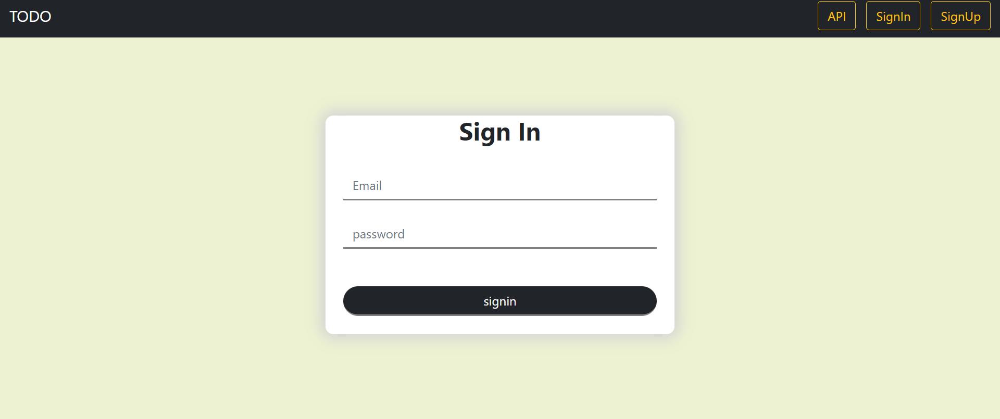
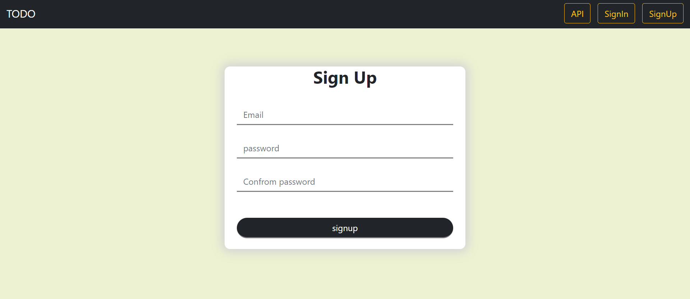
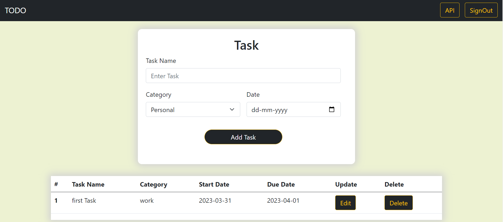
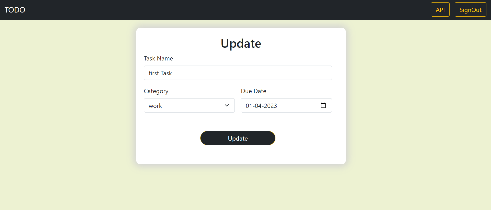
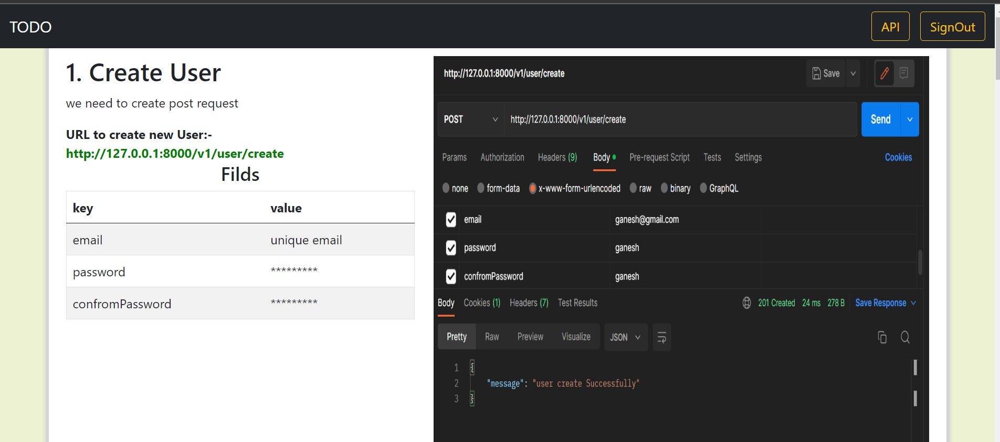

# TODO List (Boson-assignment)
We’re going to design an API as well as web page

##Functionality
1. signin and signup
2. create task
3. update task
4. delete task
5. API

##Tools 
1. Node Js  v-16.18.0
2. Express Js
3. Mongodb Atlas
4. Mongoose
5. passport local (for authentication purpose)
6. passport JWT (for authentication purpose)
7. connect-flash

##Setup in Local System

1. clone the repo in your System.
2. go to folder you want open cmd/power shell/git-bash. 
3. then just run:- git clone https://github.com/tush8788/TodoList-boson-.git
4. after download done 
5. open command prompt and Type 'npm install' for download all dependencies 
6. then just "npm start"/ if npm start is not work just run this command 'node index.js'
7. then go localhost:8000

## This Site is hosted on cyclic.sh
1. Access link "https://cloudy-fox-garment.cyclic.app"

##Screen Short
1. Signin

2. Signup

3. Dashboard

4. Update Task

5. API

